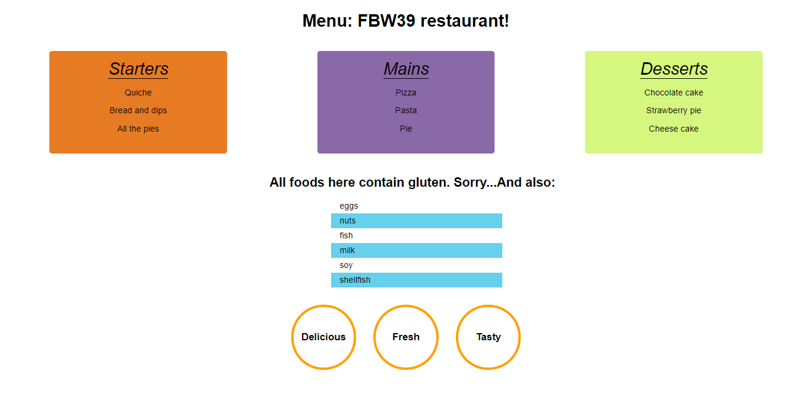

# Menu Styling 
In the repository, there is an `index.html` starting file which has the skeleton of an online menu. Style the menu by following the instructions below. 

## Important Concepts
For this task we will practice the selectors for the elements in the html document. For this task you will need to use 4 different ways of selecting elements from the document. 
- document.getElementById("id"). This method an element from the html document that match the same ID that you pass inside the parentheses.[more info here](https://developer.mozilla.org/en-US/docs/Web/API/Document/getElementById)

- document.getElementsByTagName("tag name"). This method returns all elements with the tag name passed inside the paretheses.[more info here](https://developer.mozilla.org/en-US/docs/Web/API/Document/getElementsByTagName)

- document.querySelector("selectors"). This method returns the first element that match the selector passed in the parentheses. This selector has the same sintax as the css selectors. For example, for class: `.className`. For an specific ID: `#id` and so on. [more info here](https://developer.mozilla.org/en-US/docs/Web/API/Document/querySelector)

- document.querySelectorAll("selectors) This method returns **ALL** the elements that match the selector passed in the parentheses. This selector has the same sintax as the css selectors. [more info here](https://developer.mozilla.org/en-US/docs/Web/API/Document/querySelectorAll)

**Rules**: 
* All changes to the menu should be done in JavaScript! No CSS!! No HTML!!
* Select the elements from the HTML document using the method you think will be better.
* Extra points if the page is responsive.

**Instructions**: 
* Change the font of the `body` element. 
* Center the text of `h1` on the page.
* Change the style of the `container` to see the inside elements in a row next to each other.
* The menu headings have are a made with a `label` tag. Select the elements by tag name. Then, change the `color`,`font-size` and  `font-style` of each element. 
* Each menu categorie has a different id: `Starters`,`Mains`, `Desserts`. Select each element by id and change the style so it looks similar to the image in the bottom. The background color can be different from the one in the image.
* Select the warning at the end of the page by its id `warning`. Change the size and font of the `warning`.
* Select the section `allergy-warning` by id and make the content appear as a column in the center of the page.
* The descriptions in the footer should also be styled, e.g. a rounded border with a background color. They should appear in a column for mobile and in a row for desktop.
* **EXTRA**. The style for the list items inside the menus is missing. You could use a selector for selecting the list items inside the unordered lists inside the container. Think of how the css selector would be. Then apply the style to each of them.
* **EXTRA**. The style for the list items inside the warning is missing. You could use a selector for selecting the odd list items and even list items. Think of how the css selector would be. Then to even list items change the background.

**Images**:

**Notes**:
* Follow the instructions to create a menu. You can add any additional styling. 
* Deadline: 2hrs.
* See reference images. 

